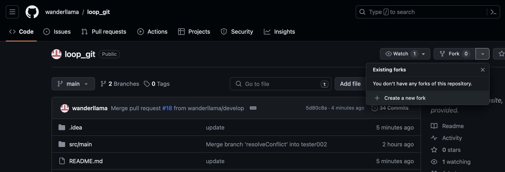

## Resolve Conflicts when working with Protected Branches

This project is using gitflow git workflow as the branching strategy. The project is using a develop branch to merge feature branches into instead of merging them directly into main.
The develop branch is the only branch allowed to merge into the main branch. The main and develop branch both have protections requiring pull request before merging and these branch can
not be merged directly. The goal is to resolve a merge conflict that is preventing a branch from merging into develop.

&nbsp;  
#### You can fork and clone the project. Forking the project will allow you to practice without anyone else pushing code you are not expecting.  
* log into GitHub and navigate to [repository](https://github.com/wanderllama/loop_git)
* click on fork in the top right corner
* unselect the checkbox _Copy the master branch only_ 
* now you can clone the project and click [here](#Start) to start

&nbsp;  
#### ... Or, create your own project
If you want to create your own project to practice you can start a new project and follow these steps to enable git, create develop branch, share project on GitHub, and create branch protection rules (optional).  

* Enable vcs and select git using git tab in intellij (first option)  
* Share project on GitHub from git tab located under the GitHub section  
* Create develop branch -> _git checkout -b develop_
* Push develop branch upstream -> _git push --set-upstream origin develop_
* **optional** branch protections
  * Log into GitHub, navigate to repository and click on settings.
  * Click on branches in left nav. 
  * In pattern field type the name of default branch and select Require a pull request before merging checkbox 
  * Add protection rule for develop branch the same way as master.

&nbsp;
### Start
#### tester1 and tester2 are at the beginning of the sprint and are ready to create their automations

* they open their IDE and the first thing they do is they pull and update their local 
  * _git checkout master_ 
  * _git pull origin master_
  

* create a new branch for each tester. Many projects using JIRA require branch names to match with the ticket getting worked   
  * _git checkout develop_ 
  * _git branch B2G2-096_
  * _git branch B2G2-098_ 
  

* they both checkout to their new branch and start working 
  * _git checkout B2G2-096_ 
  * _git checkout B2G2-098_
  
  
* you can create a new branch and checkout to the new branch in one command
    * _git checkout -b branchName_    
&nbsp;
### Tester 1 steps
#### For this practice we will walk through tester1 first and create a pull request and merge their work then complete the tester2 steps


* checkout to tester ones branch
  * _git checkout B2G2-096_
  

* create a test in src/test/java/com/loop/test/TestCases.java on line 18-21. **No implementation needed**  
```java
    @Test
    public void test01() {
        
    }
```
  
* update method on line 16 of src/test/java/com/loop/utility/Utilities.java to accept String[] arr instead of two String variables
```java
    private void resolveConflictMethod(String[] arr) {
        
    }
```

* Tester one then begins to commit their work by staging the unversioned files. A file is unversioned when it is new and git has not marked it for versioning yet.  
    * _git add ._ or _git add --all_
  

* Tester one commits to their local repository. Message is mandatory and good practice is having a detailed message explaining the changes in the commit.  
    * _git commit -m "message"_


* add tester 1s branch to remote repository. A local branch that does not exist on the remote repository must be added before you can push to remote repository
  * _git push --set-upstream origin develop_  


* Tester one pushes their local repository to the remote repository
    * _git push origin B2G2-096_
  

* tester one will log into GitHub and create a pull request to merge their branch into develop branch then they will report to their test leads or code reviewers letting them know they created a PR. Complete the merge request and merge tester 1s branch into develop

&nbsp;
### Tester 2 steps

* Checkout to test 2s branch you created at the [beginning](#Start)
  * _git checkout B2G2-098_  

  
* Create a test case on line 18-21 of the src/test/java/com/loop/test/TestCases.java test class  
```java
    @Test
    public void test02() {
        
    }
```

* Create a new utility method on line 147-150. Overload method on line 16. the method accepts String[] parameter. 
```java
    private void resolveConflictMethod(String[] arr) {
        
    }
```
  
* Stage the unversioned files before committing changes to local repository
  * _git add --all_  
  

* Commit changes to local repository
  * _git commit -m "message"_  
  

* add tester 2s branch to remote repository and push. A local branch that does not exist on the remote repository must be added before you can push using _git push_
  * _git push --set-upstream origin B2G2-098_  
 

* tester two will log into GitHub and create a pull request to merge their code into develop branch and sees that there is a conflict that needs to be resolved.  
&nbsp;  

#### To resolve the conflict using IntelliJ resolve conflict GUI we need to ***merge code in remote develop into tester 2s original branch***. Projects with protected branches prevent merging local and remote develop directly into another branch without creating a PR.

#### Instead of merging develop into tester 2s branch we can create a copy of remote develop and merge the copy into tester 2s branch and trigger the resolve conflict GUI

We can use the commands in the left column to trigger IntelliJ resolve conflict GUI

git commands|description
-----|-----
git checkout develop|switces our working branch to develop
git pull origin develop|updates local develop branch to match remote develop branch. We want to merge the code from remote develop into the branch with conflicts
git checkout -b remoteDevelopCopy|create a new branch while checked out to local develop. New branch is identicle to remote develop
git checkout B2G2-098|switch our working branch to our original branch that has conflicts with remote develop
git merge remoteDevelopCopy|merge the copy of remote develop we created into original branch

* first we checkout to local develop and update local develop
* create new branch while checked out to develop
* checkout to original branch then use new branch to merge into original branch. git will attempt to combine the two branches and trigger a conflict.
&nbsp;  
  &nbsp;


* Tester 2 can now resolve the conflicts using IntelliJ GUI by navigating to commit panel located on left side (used for making commits and pushing).
  

* Delete the branch used to merge into original  
  * _git branch -D remoteDevelopCopy_
  

* Push changes to remote repository and create a PR
    * _git push_
  


